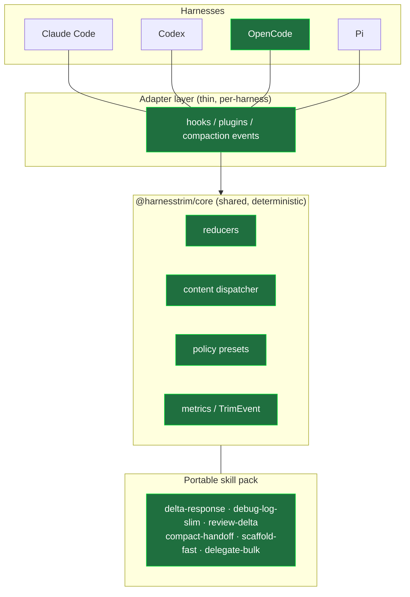
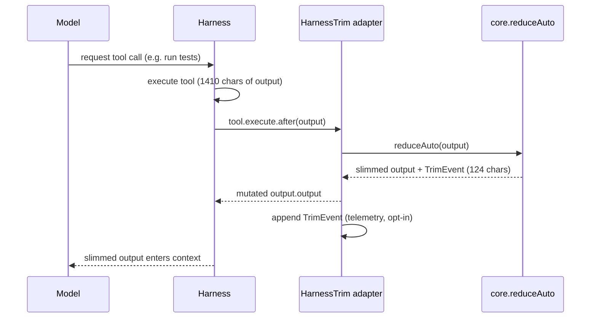
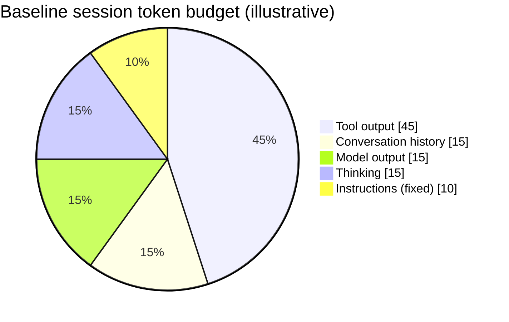
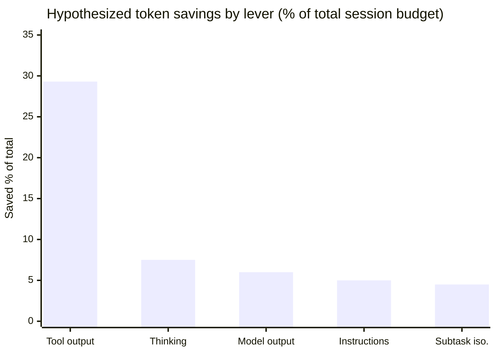
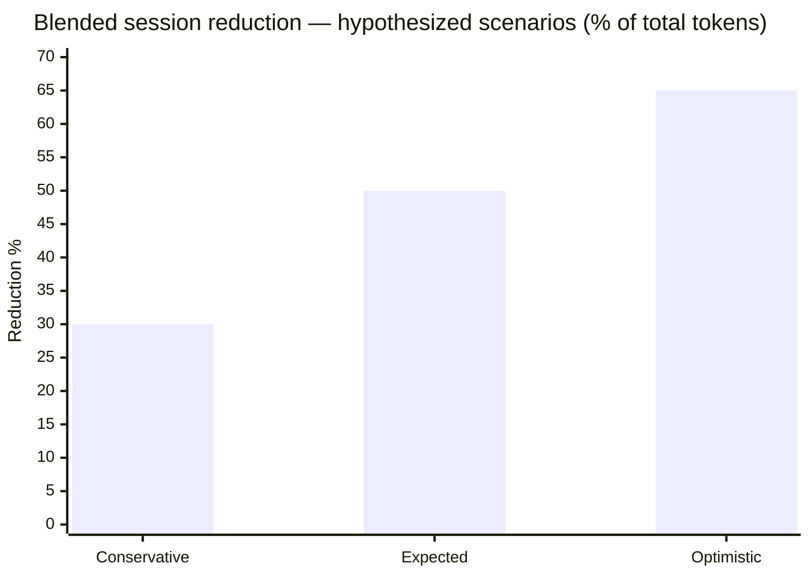

# HarnessTrim

> One token policy for Claude Code, Codex, OpenCode and Pi.

HarnessTrim is a **cross-harness control plane** for coding agents: a portable skill pack, thin
per-harness adapters, and a reproducible benchmark suite that together cut input tokens, output
tokens, and noisy tool output — instead of optimizing just one of those layers the way existing
tools do.

Full design rationale and phased roadmap: see [PLAN.md](PLAN.md).

---

## The problem

In a coding agent, tokens are spent across several channels — and most tools only attack one of them:

| Channel | What fills it | Who attacks it today |
| --- | --- | --- |
| **Tool output** | test logs, `git diff`, grep, build output, big JSON, file reads | RTK (shell only) |
| **Model output** | the agent's own verbosity | Caveman |
| **Thinking** | reasoning tokens, billed as output | mostly nobody |
| **Fixed instructions** | always-loaded `CLAUDE.md`/`AGENTS.md` | skills (native) |
| **Conversation history** | everything that survives compaction | compaction (native) |

Each existing tool moves one lever. The waste is spread across all of them, so single-lever tools
leave most of the budget on the table. HarnessTrim's thesis: **coordinate all five levers behind one
policy**, using the deterministic hook/skill primitives every modern harness already exposes.

## Strategy: skill-first, adapter-second, measured

Three principles, in priority order:

1. **Skill-first.** The portable value is a pack of Agent Skills (the format every target harness
   already understands). Skills carry the policy; they cost almost nothing until invoked.
2. **Adapter-second.** Thin per-harness adapters translate one shared policy into each harness's
   native dialect (hooks, plugins, compaction events). Adapters are where the real work is — and
   where fragility lives — so they stay deliberately small and delegate all logic to the shared core.
3. **Measured, not asserted.** Every claim is backed by a reproducible benchmark. Competitors report
   self-measured numbers that don't compose; HarnessTrim ships the measurement harness itself.



*Green = shipped for the OpenCode MVP. Other harnesses reuse the same core and skills via their own adapter.*

### The five levers

| Lever | Mechanism | HarnessTrim component |
| --- | --- | --- |
| **Progressive disclosure** | recurring instructions live in on-demand skills, not always-loaded files | skill pack + `doctor` |
| **Tool-output reduction** | a deterministic reducer slims noisy output before it reaches the model | `reducers` + adapter `tool.execute.after` |
| **Thinking routing** | match reasoning effort to task type (low for mechanical, high for architecture) | policy presets (advisory) |
| **Subtask isolation** | isolate/handoff noisy work instead of polluting the main context | `compact-handoff` + `delegate-bulk` skills, compaction hook |
| **Observability** | normalize what was actually saved into one schema | `TrimEvent` + `metrics` |

## How tool-output reduction works

The adapter intercepts tool results, the shared core decides what (if anything) to slim, and only the
signal reaches the model. Reducers are **deterministic and idempotent** and never touch the cacheable
prompt prefix — so they shrink cost without busting the prompt cache.



## KPIs

What HarnessTrim optimizes for, and how each is measured:

| KPI | Definition | Target | Source |
| --- | --- | --- | --- |
| **Tool-output reduction** | 1 − (chars out / chars in) per reduced tool call | ≥ 50% on noisy output | adapter telemetry, benchmark |
| **Blended session reduction** | total tokens saved / baseline session tokens | 30–50% (model) | end-to-end benchmark (Tier B, planned) |
| **Quality retention** | task-success parity vs the untrimmed baseline | 100% (no regressions) | Tier B benchmark |
| **Cache preservation** | share of reductions that leave the cacheable prefix untouched | 100% | design guarantee (reducers only touch volatile output) |
| **Coverage** | share of noisy tool calls that a reducer actually matched | grow over time | telemetry (`reducer: null` = missed) |
| **Overhead** | added latency / tokens from the stack itself | negligible | reducers run locally, no tokenizer in-process |

## Savings: measured vs hypothesized

Two honesty tiers. Keep them separate.

### Measured (real numbers today)

- **Reducer micro-benchmark (Tier A, no LLM):** −65% tokens across the seed fixtures (`pnpm run bench`).

  | Fixture | Reducer | Tokens | Reduction |
  | --- | --- | --- | --- |
  | jest, mostly-pass | test-output-slim | 408 → 216 | −47.1% |
  | pytest, mostly-pass | test-output-slim | 395 → 211 | −46.6% |
  | lockfile-heavy diff | git-diff-slim | 939 → 183 | −80.5% |
  | **Overall** | | **1742 → 610** | **−65%** |

- **One live OpenCode session:** a real `bash` test run was reduced **1410 → 124 chars (−91.2%)** in the
  actual pipeline (see PLAN.md §9, Phase 2 hardening).

These cover the tool-output lever only, on selected inputs. They are not a session-wide claim.

### Hypothesized (illustrative model, not measured)

To reason about the *blended* win we model a "typical" medium debugging session. **These percentages
are an engineering hypothesis to be validated by the Tier B benchmark — not results.**

Baseline budget of an illustrative session, by channel:



Applying a *conservative* per-lever reduction to each channel:

| Lever | Channel share | Assumed reduction of channel | Saved (% of total) |
| --- | --- | --- | --- |
| Tool-output reduction | 45% | 65% | 29.3% |
| Thinking routing | 15% | 50% | 7.5% |
| Model-output discipline | 15% | 40% | 6.0% |
| Progressive disclosure | 10% | 50% | 5.0% |
| Subtask isolation | 15% | 30% | 4.5% |
| **Blended** | | | **≈ 52%** |



Scenario range (blended reduction of total session tokens):

| Scenario | Assumptions | Blended reduction |
| --- | --- | --- |
| Conservative | low per-lever rates, tool output only partially matched | ~30% |
| Expected | the table above | ~50% |
| Optimistic | noisy debugging session, high tool-output share | ~65% |



> **Why the model is plausible but unproven:** the tool-output lever (the largest slice) is already
> backed by the measured −65%/−91.2% numbers above. The other levers are extrapolated from vendor
> documentation on reasoning-token billing, prompt caching, and progressive disclosure. The Tier B
> end-to-end benchmark (planned) will replace this section's hypotheses with measured, quality-checked
> numbers comparing *vanilla harness* vs *harness + HarnessTrim*.

---

## Status

Phases 0–3 complete (reducers, benchmark, skill pack, OpenCode adapter, CLI, telemetry, presets),
plus a real-session hardening pass. Current MVP target: **OpenCode** (see `PLAN.md` §5 for why).
54 tests passing, typecheck clean on all packages.

## Layout

```
packages/core/              deterministic, idempotent reducers + content dispatcher + presets + metrics
packages/adapter-opencode/  OpenCode plugin: slims tool output + injects compaction handoff + telemetry
packages/cli/               harnesstrim CLI: doctor, install, preset, metrics, bench
skills/                     portable Agent Skills (delta-response, debug-log-slim, review-delta,
                            compact-handoff, scaffold-fast, delegate-bulk)
benchmarks/                 Tier A micro-benchmarks: reducer token-reduction, no LLM involved
examples/opencode/          minimal opencode.json wiring the adapter (dry-run)
```

## CLI

```sh
pnpm exec harnesstrim doctor [dir]            # diagnose token-waste signals in a project
pnpm exec harnesstrim install opencode [dir]  # wire the adapter into opencode.json (dry-run)
pnpm exec harnesstrim install opencode --apply
pnpm exec harnesstrim install opencode --preset lean-debug --apply
pnpm exec harnesstrim preset list             # list policy presets
pnpm exec harnesstrim preset show lean-review
pnpm exec harnesstrim metrics [path]          # summarize adapter telemetry (JSONL)
pnpm exec harnesstrim bench                    # run the Tier A reducer micro-benchmark
```

- `doctor` flags oversized always-loaded instruction files (CLAUDE.md/AGENTS.md/...), reports
  whether on-demand skills are used, and whether the OpenCode adapter is wired in.
- `install` is dry-run until `--apply`; `--preset` bakes a policy preset's adapter config in.
- `metrics` aggregates the telemetry the adapter emits (off by default) into chars saved per reducer.

## Try it

```sh
pnpm install
pnpm run test        # unit tests (core reducers + dispatcher + adapter hooks)
pnpm run typecheck   # type-check every package against real dependency types
pnpm run bench       # Tier A micro-benchmark: token reduction on fixed fixtures
```

## Use it in OpenCode

See [`packages/adapter-opencode`](packages/adapter-opencode/README.md) and
[`examples/opencode`](examples/opencode/). Start in `dryrun` mode, then switch to `active`.

## License

MIT — see [LICENSE](LICENSE).
